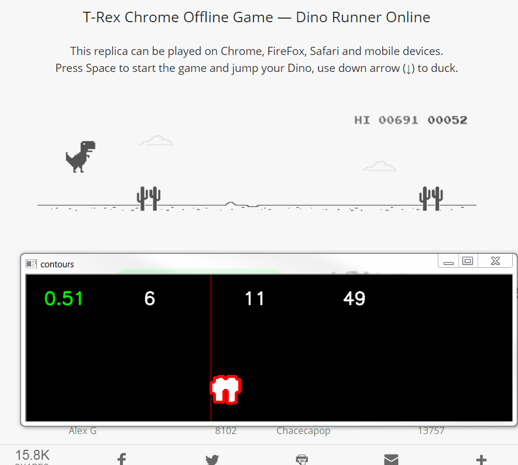

# Chrome Dino Project
## Playing and solving the Chrome Dinosaur Game with Evolution Strategies and PyTorch

##### Summary
- Capturing image from the game - **OK**
- Allowing control programmatically - **OK**
- Trying a simple implementation of rules-based agent with classic CV algorithms - **OK** 
- Capturing scores for fitness and reward - **OK**
- Creating the environment for RL - **OK**
- Developing a RL agent that learns via evolution strategies - **OK**
- Different experiments on both agent and method of learning

##### Ideas 
- Taking as input of the neural network
  - The boundaries of the obstacles in a 1D vector
  - The raw image
  - The processed image
- Initialize the agent with hard coded policy
- Combine the RL agent and the rules-based Agent
- Try other evolution strategies
  - Crossover on the fitness
  - Simple ES
  - CMA-ES

##### Experiments : 
1. **Genetic algorithm** : Generation of 20 dinos, 5 survive, and make 10 offsprings. 10 random dinos are created to complete the 20 population. Did not work at all after 100 generations, still an average score of 50 which is stopping at the first obstacle. This was tested without mutations. The Neural Network is very shallow MLP with one 100-unit hidden layer. 
2. **Genetic algorithm** : Generation of 40 dinos, 10 survive, make 45 offsprings, but only 40 are selected at random to recreate the 40-population. Added mutations with gaussian noise at this step. Tried as well with a shallow MLP but also with a simple logistic regression in PyTorch
3. **Genetic algorithm** : Generation of 50 dinos, 12 survive, make 66 offsprings, but only 38 are selected at random to recreate the population. The input is now modelled by a vector with the position on the x axis of the next 2 obstacles. Thus I went back to a shallow MLP with the following structure ``(2 input features,50 hidden layers,1 output)`` giving me the probability to jump. When ensuring a high mutation factor for the gaussian noise to have more exploration. The dinosaurs reach a max score of 600 in about 70 generations of 50 dinos (6 hours on my laptop). But they fail when reaching the birds that were not included in the training. 
4. **Evolution Strategy** : I went back to a simple evolution strategy to focus the training on the dino with the good behavior. The selection will be the top 10 or 20% at each generation. Then the next generation is created based on the fittest on which is adding gaussian noise as the mutations. With this strategy the dinosaur reach a max score of 600 in about 20 generations of 50 dinos. This works better than the last solution, but it is always falling to local optimas with dino jumping all the time to maximize their score. 
5. **Evolution Strategy** : to correct the bad behavior of jumping all the time, I added a discount factor if moves are done when there is no obstacles. By counting the number of obstacles passed and the number of moves. The new reward is then modelled in the fashion of the Bellman equation, by incrementing a discounted reward to the previous reward. With this correction, after one generation the "always-jumping" behavior has disappeared, and with a few generations the dinos reach a good enough policy. In 10 generations of 10 dinos only (only 10 minutes on my laptop) we reach easily the max score of 600 previously reached, with a good enough average policy. But new issues arise : birds that come after 600 points which require to duck, speed increasing over time, long obstacles which would require to jump before. Here is a screen capture of the game at this state : 

 

##### Misc
- Finding parameter on when to jump
- Logreg/NN on the first and second position of obstacles
- ML + Heuristics model
- Bayesian priors