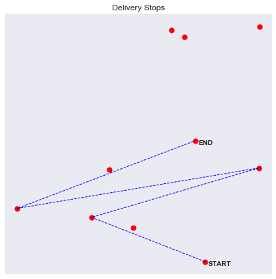
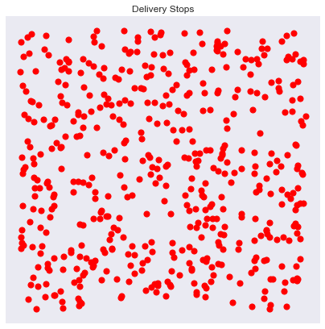
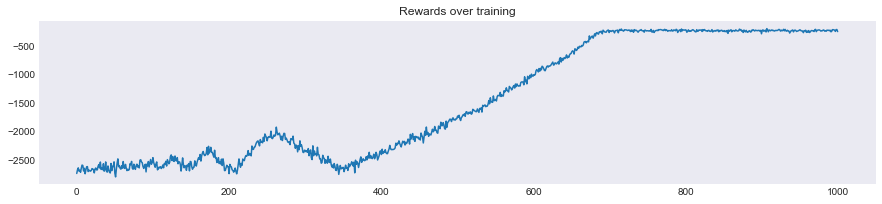

# Delivery optimization with Reinforcement Learning

This folder contains experiments to solve transportation optimization using **Reinforcement Learning** algorithm  
It will use the code of RL agents previously created in this repo.

> The overall goal is to optimize routing between deliveries via **experience replay**  
> And be robust to anomalies such as traffic slowing down the vehicles in a zone

##### Preliminary remarks
Such a problem (Travelling Salesman Problem) has many possible solutions including brute force or heuristic solutions.  
The goal here was to demonstrate the use of Reinforcement Learning in particular **when the cost function between two points is stochastic** 
It shows also a different resolution with a algorithm that could be used in a live system and automatically improves other time towards the best stragies.  

# The environment 

## Environment implementation

All the environment was coded from scratch with parameterized : 
- Number of stops for delivery
- Traffic zone size (optional)
- Traffic intensity (optional)

*The convention used are the same as for OpenAI Gym's environments* 
*Only numpy and other basic libraries are used here for the environment*

##### Base environment with one trajectory

##### Base environment with 500 stops

##### Base environment with traffic zone

## Rewards
- Rewards from the environment between two delivery stops are simply the time elapsed between two travels which is calculated by taking the euclidean distance between two points plus a gaussian noise
- If the trajectory between two stops goes through the traffic zone, the time elapsed is longer via a noise proportional to the distance through the zone and the traffic intensity parameter

# The algorithm 

## Q-Learning
- A simple **Q-Learning** algorithm already gave interesting results. 
- The **reward** taken was the opposite of the time elapsed taken from the environment
- An **epsilon-greedy** strategy allow to discover new paths and strategies while exploring

##### Training
Over experience replays, the delivery takes less and less time

### Results
##### 50 stops with no traffic

##### 100 stops with no traffic

##### 500 stops with no traffic

##### 100 stops with intense traffic

##### 500 stops with intense traffic

# Next steps
- Test other simple algorithms like SARSA
- Switch from discrete to continuous problems with Deep-Q-Learning (start including continuous observation space) and then DDPG (including continuous action space)

