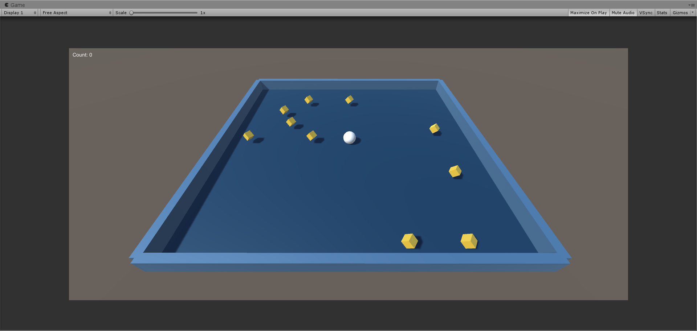

# Unity ML Agents test

> I've been creating environments directly with Python for a few years now, yet I've been facing lots of limitation due to the nature of Python<br>
> In 2020, the best option is probably Unity ML Agents. 
> This repo will hold experiments on custom Unity environments/games and Reinforcement Learning to attempt solving them

## Rolling a ball (January 2020)

> My first experiment is a simple game about rolling a ball affected by gravity trying to catch all 10 pickups randomly placed in the environment. Movement is directly affected by inertia. To create the same env, follow Unity official tutorial https://learn.unity.com/project/roll-a-ball-tutorial


## References ✨
### To learn about Unity
- Youtube holds greats resources such as Brackeys, Sebastian Lague or Jason Weimann channels. Huge thanks to those videos for teaching about Unity in such an entertaining way. 
- Unity official tutorials are great as well. 


### To learn about Unity ML Agents
- Documentation at https://github.com/Unity-Technologies/ml-agents/blob/master/docs/Readme.md
- Creating custom environments https://github.com/Unity-Technologies/ml-agents/blob/master/docs/Learning-Environment-Create-New.md
- Overview of how UML works https://github.com/Unity-Technologies/ml-agents/blob/master/docs/ML-Agents-Overview.md
- [This great video](https://www.youtube.com/watch?v=x2RBxmooh8w)


## Installing ML Agents
Follow [tutorial at this link](https://github.com/Unity-Technologies/ml-agents/blob/master/docs/Installation.md)

- Install Python wrapper with pip
```
pip install mlagents
```
- Clone ML Agents repo
``` 
git clone --branch latest_release https://github.com/Unity-Technologies/ml-agents.git
```
- Install Barracuda
- Copy ML-Agents folder from the cloned repo at ``UnitySDK/Assets`` in your Assets project folder